# Database Schema: MBG Management System

Dokumen ini mendeskripsikan struktur basis data (Database Schema) dari backend aplikasi **MBG Management System** yang dirancang menggunakan *GORM* (Golang).

## Entity Relationship Diagram (ERD)

```mermaid
erDiagram
    %% Core Entities
    Dapur ||--o{ InvestorParticipant : "has many"
    Dapur ||--o{ Route : "operates"
    Dapur ||--o{ FinancialRecord : "tracks"
    Dapur }o--|| Koperasi : "managed by"
    Dapur {
        uint id PK
        string name
        string type "INVESTOR | BANGUN_SENDIRI"
        string address
        float lat
        float lng
        int capacity
        string status
        string region
        float investor_share
        float dpp_share
        float daily_rental_rate "Default: 6000000"
        int portion_count
        uint koperasi_id FK
        string sppg_id
    }

    InvestorParticipant {
        uint id PK
        uint kitchen_id FK
        string name
        float investment_amount
        float share_percentage
        string saham_ratio "e.g. 75% : 25%"
    }

    Koperasi {
        uint id PK
        string name
        string address
    }

    Route {
        uint id PK
        uint kitchen_id FK
        string route_name
        string vehicle
        string driver
        string status
        string eta
    }

    FinancialRecord {
        uint id PK
        uint dapur_id FK
        datetime period
        int total_portions
        float rental_income
        float selisih_bahan_baku
        string status "PENDING, APPROVED"
    }

    %% Finance & Procurement Module
    Transaction {
        uint id PK
        string date
        string type "income, expense"
        string category
        float amount
        string status
    }

    Loan {
        uint id PK
        string number UK
        string lender
        float amount
        float margin_rate
        float monthly_payment
        float remaining_balance
        string status
        string start_date
        string end_date
    }

    Equipment {
        uint id PK
        string name
        string category
        float price
        int stock
        string supplier
        string status
        string image
    }

    PurchaseOrder {
        uint id PK
        string number UK
        string supplier
        int items_count
        float total_amount
        string status
        string date
    }

    %% HR Module
    Employee {
        uint id PK
        string number UK
        string name
        string position
        string department
        string hire_date
        float salary
        string status
        string photo
    }

    Vacancy ||--o{ Applicant : "receives"
    Vacancy {
        uint id PK
        string title
        string department
        string category
        string type
        string description
        string status
        string posted
        string deadline
    }

    Applicant {
        uint id PK
        uint vacancy_id FK
        string name
        string email
        string status
        string interview_date
    }

    %% SPPG Gallery Module
    Sppg ||--o{ SppgMedia : "has photos"
    Sppg {
        uint id PK
        string sppg_id UK
        string name
        string location
        string progress
    }

    SppgMedia {
        uint id PK
        string sppg_id FK
        string preview_url
        string media_type "image"
    }
```

---

## Deskripsi Rinci Model Database

### 1. Modul Dapur & Keuangan Inti (`kitchen.go`, `core.go`)
- **`Dapur`**: Entitas utama (Kitchen). Melacak lokasi, jenis kepemilikan (`INVESTOR` / `BANGUN_SENDIRI`), *sharing ratio*, *flat rate* sewa dapur per hari, serta terikat dengan satu `Koperasi` penyuplai bahan baku.
- **`InvestorParticipant`**: Tabel sekunder yang meyimpan pencatatan porsi bagi hasil investasi saham para investor yang terlibat pada `Dapur` tertentu (contoh: rasio kepemilikan 60:40).
- **`Koperasi`**: Unit penyedia bahan baku (*broker*) di daerah tersebut. Relasi *One-to-Many* dengan `Dapur`.
- **`FinancialRecord`**: Mewakili hasil *cut-off* transaksi periodik harian/bulanan sebuah `Dapur`. Menyimpan rekam hitung uang operasional, setoran uang sewa, serta *margin* bahan baku.
- **`Route`**: Menyimpan data logistik wilayah dan kendaraan yang mendistribusikan porsi.

### 2. Modul Kas & Pendanaan (`finance.go`)
- **`Transaction`**: Mewujudkan jurnal transaksi murni (*Income / Expense*) yang berjalan.
- **`Loan`**: Skema utang / pembiayaan dari entri kreditur perbankan (BSI) dengan sistem *Monthly Payment* dan pemotongan saldo berjalan (*Remaining Balance*).

### 3. Modul SPPG - Fisik Bangunan (`sppg.go`)
*Menjadikan sistem selaras dengan rekapan Wadah Merah Putih*
- **`Sppg`**: Entri fisik/kontrak pembangunan dapur yang berisi ID Unik, Nama Proyek Lapangan, Lokasi (Sulawesi dsb), dan persentase Progres (misal `100.00%`).
- **`SppgMedia`**: Foto *evidence* dari Google Drive (`preview_url`) milik `sppg_id` tertentu. 

### 4. Modul Operasional Proc & HR (`procurement.go`, `hr.go`)
- **`Equipment`** & **`PurchaseOrder`**: Skema inventori untuk mencatat perangkat teknis dapur dan PO.
- **`Employee`**, **`Vacancy`**, **`Applicant`**: Skema kepegawaian untuk melacak honor, jabatan, performa pegawai, hingga rekrutmen karyawan dapur yang baru.

---
> Semua entitas GORM ini secara otomatis dikelola via AutoMigrate di `/backend/main.go` dan dilengkapi *soft-delete* (`gorm.DeletedAt`).
