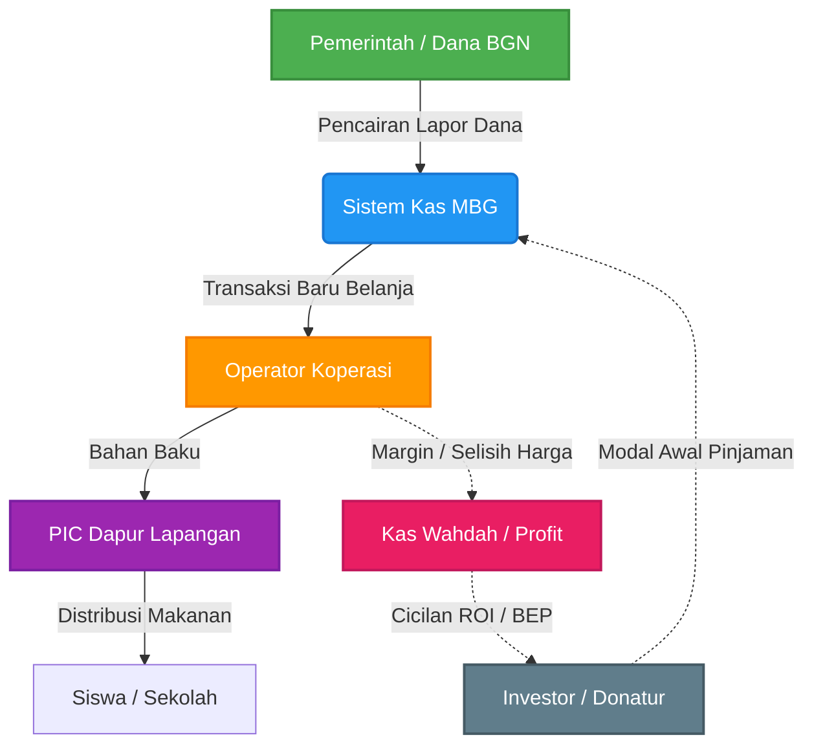
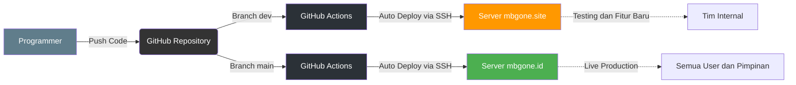

# Panduan Alur Kerja & Ekosistem Sistem MBG Wahdah

Dokumen ini disusun untuk memberikan pemahaman menyeluruh (Standard Operating Procedure) mengenai cara kerja Sistem Manajemen Makan Bergizi Gratis (MBG), mulai dari pembagian peran (Otoritas Karyawan), alur perputaran uang, hingga infrastruktur teknologi di baliknya.

---

## 1. Pembagian Peran dan Hak Akses (Role & Authorization)

Sistem ini membatasi apa yang bisa dilihat dan dilakukan oleh setiap pengguna untuk mencegah manipulasi data dan menjaga fokus pekerjaan.

### A. Koperasi Pusat (Operator Koperasi)
Koperasi bertindak sebagai **urat nadi rantai pasok (Supply Chain)**. 
* **Tugas Utama:** Membelanjakan dana untuk kebutuhan bahan pokok dalam skala grosir (ke pasar induk atau vendor) dan mendistribusikannya ke dapur-dapur.
* **Akses Sistem:** 
  * Memiliki tombol **"Transaksi Baru"** untuk mencatat seluruh uang keluar riil (belanja bahan, bayar transportasi angkut, dll).
  * Memiliki menu eksklusif **"Margin (Selisih Bahan)"** untuk memonitor keuntungan Koperasi (selisih antara harga pagu pemerintah per porsi dengan harga beli grosir riil).
  * Menjadi "Auditor" (Audit Belanja) yang memastikan bahwa semua struk/nota pengeluaran adalah valid.

### B. PIC Dapur Lapangan
PIC Dapur difokuskan murni pada **eksekusi teknis memasak dan pendistribusian makanan** ke sekolah-sekolah.
* **Tugas Utama:** Memastikan target porsi harian tercapai, armada logistik berjalan lancar, dan makanan sampai ke siswa tepat waktu.
* **Akses Sistem:**
  * **TIDAK memiliki tombol "Transaksi Baru"**. PIC Dapur tidak ditugaskan sebagai akuntan yang mencatat pengeluaran kas.
  * Hanya memiliki tombol **"Lapor Dana BGN"** untuk menekan satu tombol konfirmasi ketika dana anggaran dari pemerintah daerah/pusat sudah cair.
  * Menginput *Progress Fisik* harian dan melaporkan kendala logistik harian.

### C. Finance Pusat & Super Admin
Pemegang kendali tertinggi atas keseluruhan ekosistem MBG secara nasional.
* **Tugas Utama:** Mengendalikan hutang, piutang, pendanaan investor, dan memantau stabilitas margin keseluruhan.
* **Akses Sistem:**
  * Memiliki tombol eksklusif **"Pinjaman Baru"** untuk memasukkan data investor atau dana talangan, mengatur Nisbah/Bagi Hasil, dan mengontrol cicilan bulanan (BEP).
  * Melihat Ringkasan Eksekutif (Dashboard Nasional) yang mencakup Gross Income, Opex (Biaya Operasional), dan EBITDA.

### D. Investor / Donatur
Pihak eksternal yang memberikan dana pembangunan fisik dapur.
* **Akses Sistem:** Hanya dapat melihat *Dashboard* yang berisi angka total pendanaan mereka, status perputaran uang di dapur yang mereka danai, dan indikator (Bar Chart) menuju *Break Even Point* (BEP).

---

## 2. Alur Kerja Keuangan (Financial Flow)

Bagaimana sebenarnya uang berputar di dalam sistem ini?

1. **Fase Inisiasi (Pembangunan):**
   * Investor menaruh dana untuk membangun Dapur Percontohan.
   * Finance Pusat membuka sistem dan menginputnya ke dalam **Pinjaman Baru** (mencatat nominal, persentase bagi hasil, dan tanggal jatuh tempo).
2. **Fase Operasional (Pencairan BGN):**
   * Saat dana Makan Bergizi Gratis dari pemerintah cair, PIC Dapur (atau Koperasi) menekan **"Lapor Dana BGN"**. Saldo virtual sistem akan bertambah (Income).
3. **Fase Eksekusi (Belanja Koperasi):**
   * Uang tersebut dipegang oleh Koperasi. Koperasi pergi ke pasar induk, lalu staf Koperasi menekan tombol **"Transaksi Baru"** (Kategori: Expense/Pengeluaran - Bahan Baku). 
4. **Fase Pemisahan Laba (Net Profit & BEP):**
   * Sistem akan otomatis menghitung: `Dana BGN (Income) - Belanja Koperasi (Expense) = EBITDA (Laba Kotor)`.
   * Laba kotor ini kemudian dipotong persentasenya ke dompet **Margin Koperasi** (sebagai kas Wahdah).
   * Sisa laba bersihnya akan otomatis dicicilkan oleh sistem ke dalam angka *Remaining Balance* milik Investor, sehingga grafik "Target BEP" di layar Investor akan terus bergerak naik menuju 100%.

---

## 3. Infrastruktur IT & Otomatisasi (CI/CD Pipeline)

Untuk memastikan sistem berjalan 24 jam tanpa henti dan aman dari kesalahan *programmer*, sistem ini dilengkapi dengan arsitektur **Continuous Integration/Continuous Deployment (CI/CD)** standar industri:

* **Dua Dunia Terpisah (Environment):**
  * **Lingkungan Dev (`mbgone.site`):** Tempat *programmer* menguji coba fitur baru (seperti tombol baru atau perubahan warna). Jika ada *error*, sistem utama tidak akan mati. Data di sini adalah data mainan/demo. Di sini, tombol "Login Otomatis (Demo)" dihidupkan untuk mempermudah *testing*.
  * **Lingkungan Produksi (`mbgone.id`):** Ini adalah jantung utama. Lingkungan ini suci, menggunakan *Database* asli, dan semua tombol "Demo" dimatikan otomatis oleh sistem demi keamanan.
  
* **Robot Pen-Deploy Otomatis (GitHub Actions):**
  * Programmer tidak perlu lagi masuk ke *server* secara manual. Kapanpun programmer melakukan *Save & Push* fitur baru ke GitHub (branch `main`), robot GitHub akan otomatis masuk ke server VPS, mematikan sistem lama, menimpa file baru, melakukan instalasi, sinkronisasi *database*, dan menghidupkannya kembali dalam hitungan detik. 
  * Semua kredensial *server* dan *database* dikunci dengan aman di brankas enkripsi (*GitHub Secrets*).

---
*Dokumen ini merupakan referensi resmi bagi Dewan Pimpinan, Manajemen, Koperasi, dan Tim IT (DevOps) dalam mengembangkan maupun menjalankan program MBG Management System.*
