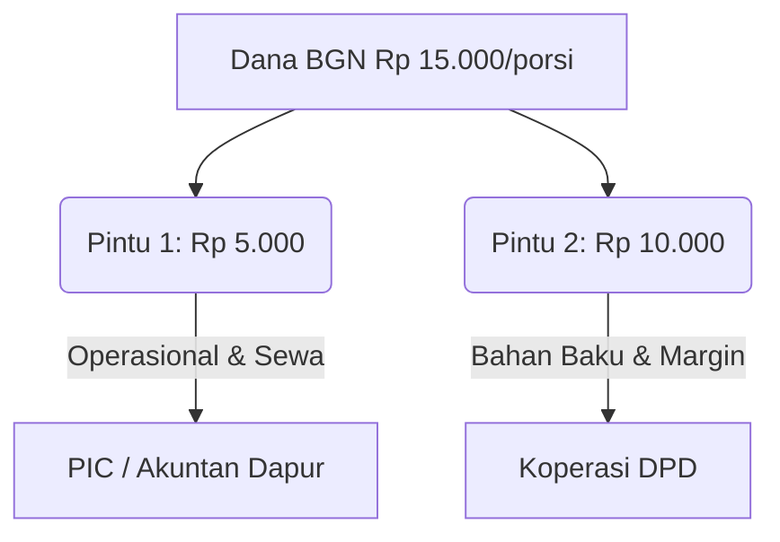
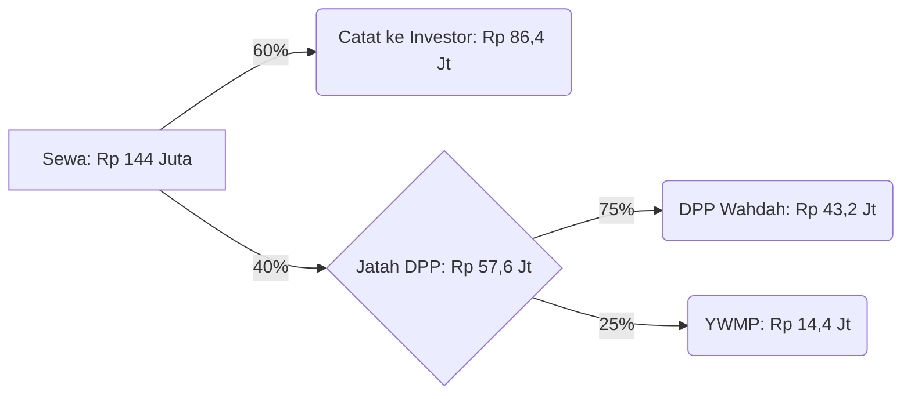
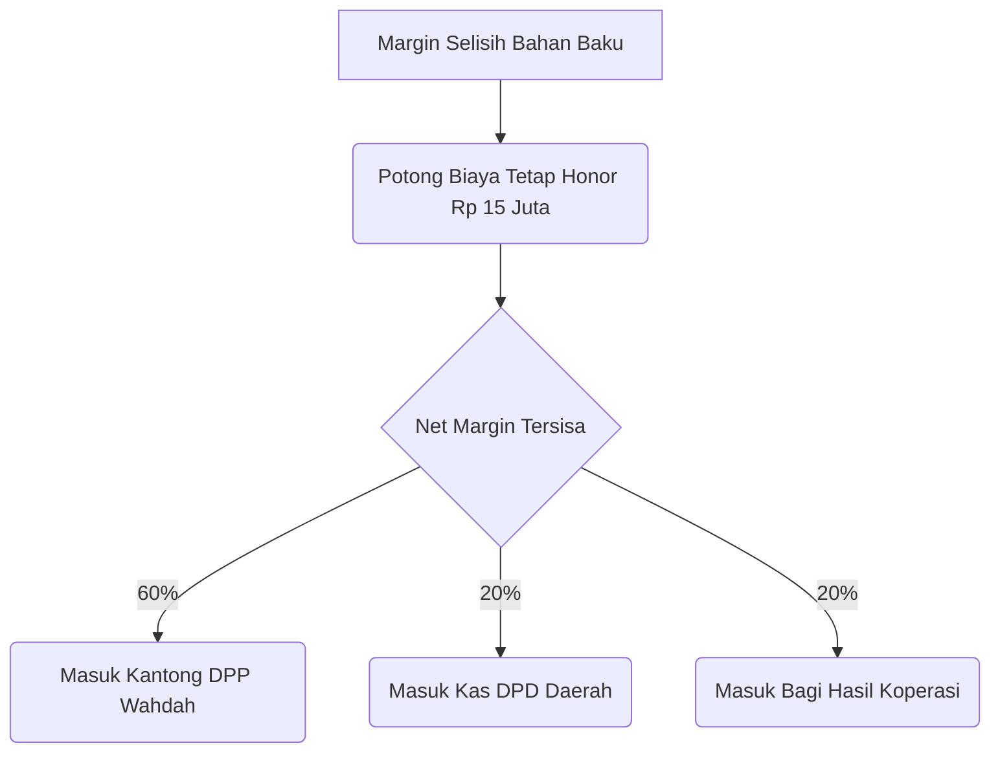

# Panduan Presentasi: Sistem Manajemen Keuangan Dapur MBG
*(User Guide & Materi Pemaparan Cara Kerja Sistem)*

Dokumen ini dirancang sebagai panduan bagi presenter/kreator untuk menjelaskan **alur kerja, keunggulan, dan mekanisme keuangan** dari aplikasi MBG Management System kepada *stakeholders*.

---

## 1. Pendahuluan & Gambaran Umum
**Poin Presentasi:** Membuka pemahaman terkait dari mana dana berasal dan kemana dana bermuara.
- **Konteks:** Program Makan Bergizi Gratis (MBG) Nasional via Badan Gizi Nasional (BGN).
- **Alur Utama:** Dana masuk secara *gelondongan* dari BGN langsung ke rekening masing-masing dapur daerah. 
- **Tujuan Sistem:** Aplikasi ini hadir sebagai "Cermin Digital" dari rekening koran dapur untuk memastikan pelacakan dana, pencatatan otomatis, dan transparansi antara pelaksana lapangan (dapur) dan pengurus pusat (DPP).

## 2. Siapa Saja Aktor di Dalam Sistem?
**Poin Presentasi:** Menjelaskan pembagian peran (Role) di dalam sistem.
1. **BGN:** Sumber mandat dan pendanaan.
2. **DPP Wahdah & DPD:** Level eksekutif yang memonitor seluruh cabang dapur.
3. **YWMP (Yayasan Wadah Merah Putih):** Yayasan penghubung resmi operasional.
4. **Investor / BSI:** Pihak entitas pendana kapabilitas infrastruktur dapur.
5. **Koperasi DPD:** Bertindak sebagai *broker* pengadaan bahan makanan di setiap daerah.
6. **PIC / Akuntan Dapur:** Operator di lapangan yang melakukan input data operasional di aplikasi.

---

## 3. Logika Inti Sistem: Pemecahan Dana Per Porsi
**Poin Presentasi:** Menguraikan pembagian dana BGN sebesar **Rp 15.000/porsi**. Pembagian ini penting dipahami krn aplikasi punya dua pintu *input*.

- 🚪 **Pintu 1 - Operasional Dapur (Rp 5.000/porsi)**
  *Diinput oleh: PIC Dapur*
  Mencakup pembayaran *fixed cost* seperti Sewa Dapur, Gaji Personel, dan Biaya Harian Lapangan.
- 🚪 **Pintu 2 - Anggaran Bahan Baku (Rp 10.000/porsi)**
  *Diinput oleh: Koperasi DPD*
  Plafon *budget* khusus untuk dibelanjakan bahan makanan riil di suplai pasar.

---

## 4. Dua Mesin Penghasil Keuntungan (Profit Generator)
Sistem ini memfasilitasi pelacakan dua sumber pendapatan utama bagi pengelola (DPP), yaitu dari **Sewa Dapur** dan **Margin Bahan Baku**.

### A. Modul Profit 1: Pendapatan Sewa Dapur (*Contoh Simulasi Real*)
- **Dasar Kalkulasi:** *Flat rate* sewa dapur dipatok seharga **Rp 6.000.000 / hari**. Dalam 1 bulan (24 Hari Kerja) nilainya mencapai **Rp 144 Juta**.
- **Otomatisasi Sistem:** Pembagian pendapatan Sewa (Rp 144 Juta) ditentukan dari siapa pemilik dapur tersebut:

#### Skenario A: Dapur Dibangun Investor External
Misal akad awal disepakati **60% untuk Investor** dan **40% untuk DPP**. Platform kami langsung menyalurkan dan mecacah secara kompehensif:

*Note: Skema ini bisa disesuaikan apabila kesepakatannya 75:25, kalkulator di sistem langsung mengikuti.*

#### Skenario B: Dapur Dibiayai Mandiri Pinjaman (via BSI)
Skema sewa tetap dikenakan kepada Pemerintah (Rp 144 Jt) via dana Operasional, TAPI pembagian profit kepada Yayasan & DPP dihitung murni berbasis *porsi*.
- **Porsi Total Profit:** Dianggap **Rp 2.000 / porsi**.
  - **DPP Wahdah:** Mengambil Rp 1.600 / porsi
  - **YWMP:** Mengambil Rp 400 / porsi

---

### B. Modul Profit 2: Margin Selisih Bahan Baku
*Disinilah transparansi sejati diuji. Koperasi DPD (broker) belanja bahan secara riil dan sisa dana menjadi Margin Bersih.*

- **Dasar Kalkulasi:** Plafon Anggaran (Rp 10.000/porsi) dikurangi Harga Riil Belanja di vendor.
- **Biaya Tetap / Deductible (Fix Cost Rp 15 Juta):** Sistem **mengamankan porsi honor bulanan** bagi pengelola lapangan sebelum margin ini dibagi, yaitu total **Rp 15 Juta** (Ka. Dapur 5jt, PIC 4jt, Akuntan 3jt, Ahli Gizi 3jt).
- **Pembagian Net Profit (60:20:20):** Margin bersih inilah yang terdistribusi ke laporan pendapatan entitas pusat dan cabang.

---

## 5. Fitur Pengawasan & Nilai Jual Aplikasi (Dashboard System)
**Poin Presentasi:** Penutup pamungkas untuk meyakinkan efektivitas penggunaan produk ini.

1. **Anti-Fraud via Input Ganda:**
   Mekanisme operasional diinput oleh *PIC Dapur*, sedangkan bukti belanja diinput oleh *Koperasi*. Pencatatan terpisah ini memastikan tidak ada entitas tunggal yang merekayasa laporan keseluruhan.
2. **Dashboard Nasional Real-time:**
   Pimpinan di pusat (DPP) dapat melihat total akumulasi keuntungan seluruh Indonesia, sekaligus melakukan *drill-down* (melihat rincian performa per titik Dapur) dalam 1 layar.
3. **Pemisahan Sumber Pendapatan Terstruktur:**
   Pemasukan dari "Sewa Dapur" dan "Selisih Bahan Baku" tidak akan pernah tercampur dalam laporannya karena sudah diikat oleh *smart algorithm* berbasis persentase sejak hari pertama setup dapur divalidasi.

---
> **Catatan Untuk Pemapar:**
> Selalu tekankan bahwa aplikasi ini bertujuan untuk mengurangi kerumitan *excel manual* yang rawan salah rumus (human error), serta meminimalisir perselisihan perhitungan antara pusat, daerah, investor, dan yayasan afiliasi.
