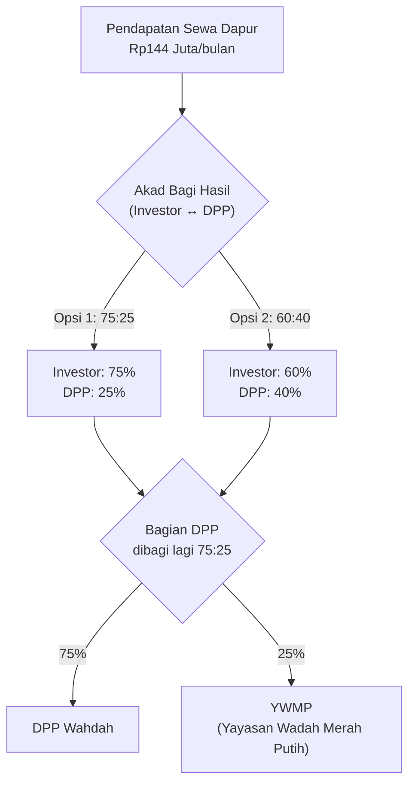
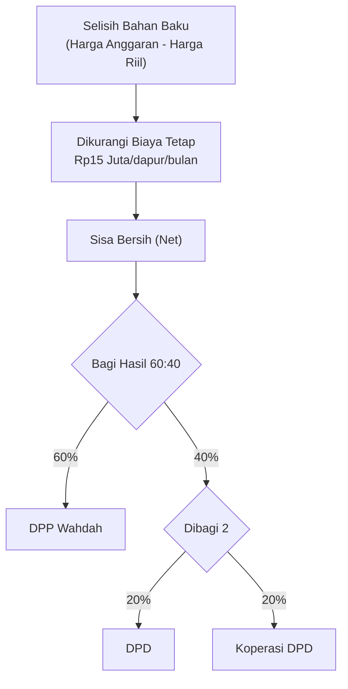
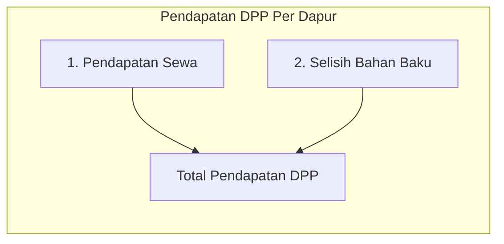
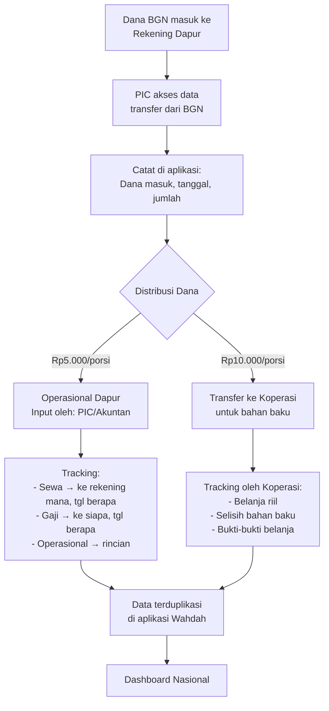
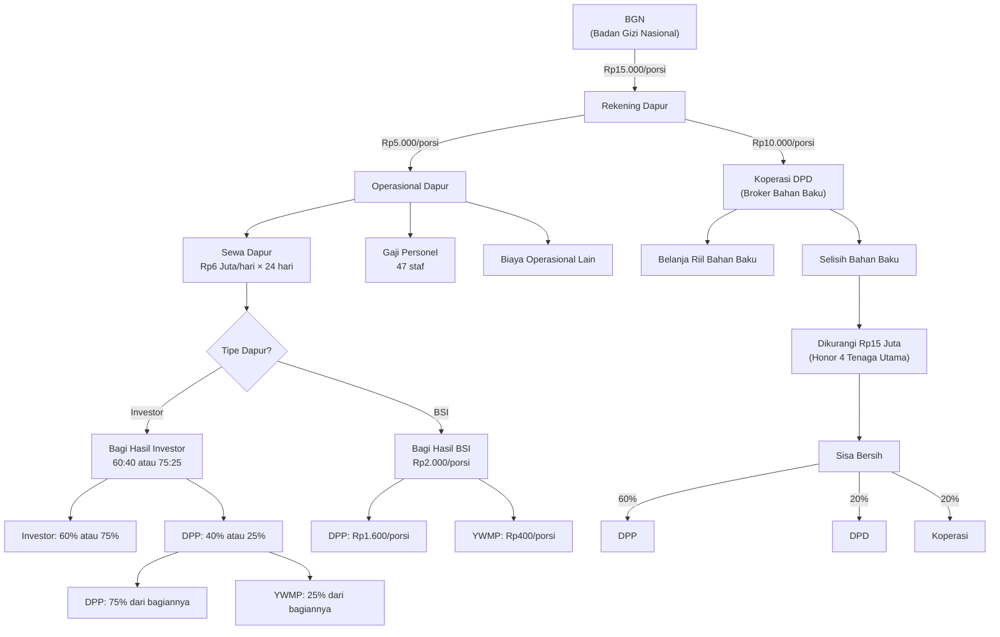

# Pemahaman Alur Keuangan & Mekanisme Bagi Hasil MBG (Makan Bergizi Gratis)

> Dokumen ini disusun berdasarkan hasil diskusi internal dan diagram whiteboard berikut.


---

## 1. Gambaran Umum

Program Makan Bergizi Gratis (MBG) dikelola melalui dapur-dapur yang tersebar di seluruh Indonesia. Dana berasal dari **Badan Gizi Nasional (BGN)** dan masuk ke rekening masing-masing dapur secara gelondongan. Pendapatan dapur terdiri dari **dua sumber utama**: **Pendapatan Sewa Dapur** dan **Selisih Bahan Baku**.

### Entitas Utama yang Terlibat

| Entitas | Peran |
|---|---|
| **BGN** (Badan Gizi Nasional) | Sumber dana utama (pemerintah) |
| **DPP** (Dewan Pimpinan Pusat Wahdah) | Pengelola program secara nasional |
| **DPD** (Dewan Pimpinan Daerah) | Pengelola tingkat daerah |
| **Investor** | Pihak yang membiayai pembangunan dapur (skema investasi) |
| **BSI** (Bank Syariah Indonesia) | Pihak pembiayaan (skema pinjaman/bangun sendiri) |
| **YWMP** (Yayasan Wadah Merah Putih) | Yayasan penghubung agar Wahdah mendapat titik MBG |
| **Koperasi DPD** | Administrator pengadaan bahan baku (broker) di tingkat daerah |
| **PIC Dapur** | Orang Wahdah yang ditempatkan di setiap dapur |

---

## 2. Struktur Dana Per Porsi

Dana dari BGN dihitung **Rp15.000 per porsi** (berlaku untuk level SMP & SMA; SD/TK lebih murah). Pembagiannya:

```
Rp15.000 / porsi
├── Rp5.000  → Dana Operasional Dapur
│              (sewa dapur, gaji personel, operasional)
│              Dikelola oleh: Dapur (input oleh PIC/Akuntan)
│
└── Rp10.000 → Dana Bahan Baku
                (pengadaan bahan makanan)
                Dikelola oleh: Koperasi DPD
```

---

## 3. Pendapatan Sewa Dapur

### Perhitungan Sewa

| Item | Nilai |
|---|---|
| Tarif sewa | **Rp6.000.000 / hari** per dapur |
| Hari kerja | **24 hari / bulan** (Ahad libur) |
| **Total sewa/bulan** | **Rp144.000.000** |

> **Catatan dari whiteboard:** Tertulis `Sewa/ 2.000 x 3.000 = 6.000.000` — ini merujuk pada perhitungan tarif sewa harian yang dulunya dikalikan jumlah porsi, namun sekarang **diratakan menjadi Rp6 juta/hari**.

Pemerintah (melalui BGN) yang membayar sewa dapur kepada penyedia dapur.

### Skema Pembagian Hasil Sewa

Pembagian bergantung pada **siapa yang membangun/membiayai dapur**:

---

### A. Skema Investor (Dapur Dibangun oleh Investor Eksternal)



**Contoh Simulasi (Akad 60:40):**

| Penerima | Perhitungan | Jumlah/bulan |
|---|---|---|
| Investor | 60% × Rp144 Juta | **Rp86,4 Juta** |
| DPP Wahdah | 75% × (40% × Rp144 Juta) | **Rp43,2 Juta** |
| YWMP | 25% × (40% × Rp144 Juta) | **Rp14,4 Juta** |

**Contoh Simulasi (Akad 75:25):**

| Penerima | Perhitungan | Jumlah/bulan |
|---|---|---|
| Investor | 75% × Rp144 Juta | **Rp108 Juta** |
| DPP Wahdah | 75% × (25% × Rp144 Juta) | **Rp27 Juta** |
| YWMP | 25% × (25% × Rp144 Juta) | **Rp9 Juta** |

---

### B. Skema Bangun Sendiri (Pembiayaan BSI)

Jika dapur dibangun dengan dana pinjaman BSI (tanpa investor), maka pembagian ke yayasan penghubung dihitung **per porsi**, bukan persentase dari sewa:

```
Rp2.000 / porsi
├── Rp1.600 → DPP Wahdah
└── Rp400   → YWMP (Yayasan Penghubung)
```

> **Catatan:** Angka Rp2.000/porsi ini adalah bagian dana yang dialokasikan untuk bagi hasil. Total porsi per dapur bervariasi, sehingga jumlah nominal yang diterima YWMP dan DPP berbeda-beda per dapur.

> Tertulis di whiteboard: `BSI — Yayasan = 400/porsi / ∆0 HPP / 1.600/jtn`

---

## 4. Pendapatan Selisih Bahan Baku

Dari dana **Rp10.000/porsi** untuk bahan baku, terdapat potensi keuntungan dari **selisih antara anggaran dan harga riil** belanja bahan baku. Selisih ini dikelola oleh **Koperasi DPD** yang berperan sebagai **broker**.

### Peran Koperasi sebagai Broker

Koperasi DPD bisa berfungsi sebagai:
1. **Penyedia murni** — langsung menyediakan bahan baku, atau
2. **Administrator** — hanya mengelola administrasi dan bukti belanja, meskipun penyedia bahan bakunya pihak lain.

> Siapapun penyedianya, koperasi **wajib menyediakan semua bukti-bukti belanja**.

### Alur Pembagian Selisih Bahan Baku



### Biaya Tetap Per Dapur (Rp15 Juta/bulan)

Sebelum selisih bahan baku dibagi, dikeluarkan dulu **honor tetap** untuk 4 tenaga utama di setiap dapur:

| No | Posisi | Honor/bulan | Keterangan |
|---|---|---|---|
| 1 | **Kepala Dapur (SPPI)** | Rp5.000.000 | Kepala satuan penyedia |
| 2 | **Akuntan** | Rp3.000.000 | Dikoreksi dari Rp2.500.000 |
| 3 | **Ahli Gizi** | Rp3.000.000 | Dikoreksi dari Rp2.500.000 |
| 4 | **PIC Dapur** | Rp4.000.000 | Orang Wahdah di lapangan |
| | **Total** | **Rp15.000.000** | *Bukan Rp16 Juta (koreksi)* |

> [!IMPORTANT]
> Di whiteboard tertulis `{16 Jt}` namun dalam diskusi dikoreksi menjadi **Rp15 Juta** setelah penyesuaian angka honor akuntan dan ahli gizi.

---

## 5. Ringkasan: Dua Sumber Pendapatan DPP



| Sumber Pendapatan | Skema Investor | Skema BSI |
|---|---|---|
| **Sewa Dapur** | 75% dari bagian DPP (setelah bagi hasil dengan investor) | Rp1.600/porsi |
| **Selisih Bahan Baku** | 60% dari selisih bersih (setelah dikurangi Rp15 Juta) | 60% dari selisih bersih (setelah dikurangi Rp15 Juta) |

> Kedua sumber pendapatan ini harus **tercatat terpisah** di sistem agar bisa dilihat rinciannya secara transparan.

---

## 6. Alur Dana Masuk & Pengawasan

### Sumber Input Data

Sistem harus menerima input dari **dua pihak** per dapur:

| Sumber Input | Data yang Diinput | Cakupan Dana |
|---|---|---|
| **Dapur** (PIC/Akuntan) | Pengeluaran operasional, gaji, sewa | Rp5.000/porsi |
| **Koperasi** | Belanja riil bahan baku, selisih | Rp10.000/porsi |

### Mekanisme Pengawasan



> [!IMPORTANT]
> **Prinsip utama:** Data akuntan di setiap dapur harus **identik** dengan data yang ada di aplikasi. Sumber datanya berasal dari rekening koran dapur.

---

## 7. Kebutuhan Database & Sistem

### Data yang Harus Direkam Per Dapur

1. **Klasifikasi Dapur:**
   - `Investor` — dapur dibangun oleh investor eksternal
   - `Bangun Sendiri` — dapur dibiayai oleh BSI

2. **Jika Investor:** Rekam akad bagi hasil → `60:40` atau `75:25`

3. **Jumlah Porsi** per dapur (bervariasi antar dapur) → berpengaruh pada perhitungan skema BSI (Rp400 × jumlah porsi)

4. **Koperasi** yang mengelola setiap dapur harus didata

### Kebutuhan Dashboard Nasional

| Fitur | Deskripsi |
|---|---|
| **Total Nasional** | Pendapatan sewa + selisih bahan baku seluruh Indonesia |
| **Detail Per Dapur** | Rincian pendapatan sewa & selisih per masing-masing dapur |
| **Drill-down** | Bisa klik dari total → lihat kontribusi tiap dapur |
| **Pemisahan Sumber** | Pendapatan sewa dan selisih bahan baku ditampilkan terpisah |

### Akun Pengguna Sistem

| Akun | Tugas Input |
|---|---|
| **PIC/Akuntan Dapur** | Data keuangan operasional (dari Rp5.000/porsi) |
| **Koperasi** | Data belanja riil bahan baku, selisih (dari Rp10.000/porsi) |

---

## 8. Diagram Alur Keseluruhan



---

> [!CAUTION]
> **Informasi ini bersifat off the record** dan hanya digunakan untuk pengembangan sistem internal tim. Tidak untuk disebarluaskan.
